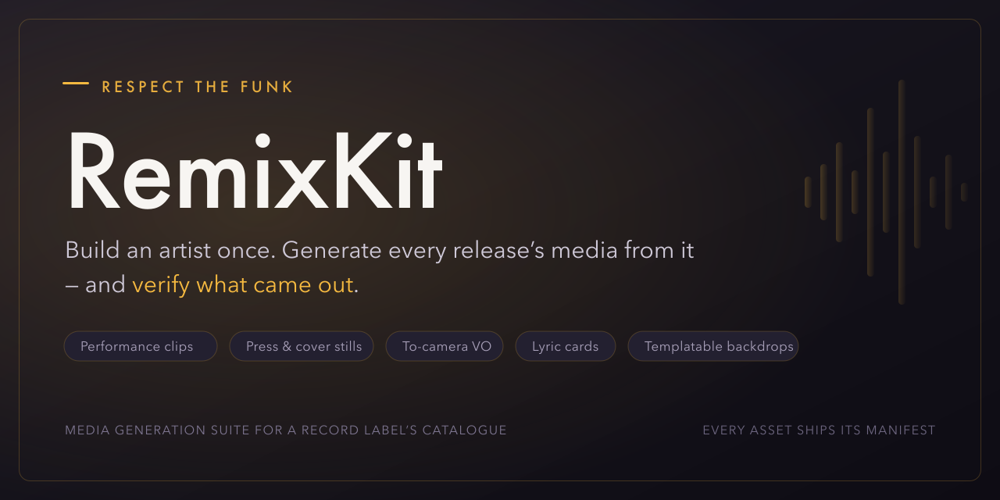

# Respect the Funk / RemixKit

A provenance-clean media generation suite for a record label: register an artist, build
their identity once, attach songs, generate whatever the release needs — performance
clips, press and cover stills, announcements to camera, voice-over, and backdrops a fan
can copy — and verify what came out.

## Layout

Four directories. Code, content, infrastructure, and everything written down.

| | What's in it | Start at |
|---|---|---|
| **[`app/`](./app/)** | The artist console — FastAPI service, deployed on AWS. Ports and adapters: `domain/`, `ports/`, `adapters/`, `services/`, `api/`, `ui/`, plus `tests/`. | [`app/README.md`](./app/README.md) |
| **[`content/`](./content/)** | The content pipeline and the specs that define it. `bin/` are the tools, `lib/` is the descriptor library (characters, hooks, stock, songs), `videos/` are the edits. | [`content/FORMAT-SPEC.md`](./content/FORMAT-SPEC.md) |
| **[`infra/`](./infra/)** | AWS infrastructure as Terraform (`terraform/envs/prod`, `terraform/modules/`), plus the priced workload models the shape was chosen from. | [`infra/README.md`](./infra/README.md) |
| **[`docs/`](./docs/)** | Everything written: product and build specs, the research program, the architecture poster, the deck, the wireframe. | [`docs/PRODUCT.md`](./docs/PRODUCT.md) |

## Reading order

1. **[`docs/PRODUCT.md`](./docs/PRODUCT.md)** — who this is for and what they do, in one page.
2. **[`docs/BUILD-SPEC.md`](./docs/BUILD-SPEC.md)** — what is being built.
3. **[`docs/research/SYNTHESIS.md`](./docs/research/SYNTHESIS.md)** — what the research phase concluded, and why the strategy is what it is.
4. **[`app/README.md`](./app/README.md)** — how the running thing is put together.

### The rest of `docs/`

- **[`PIPELINE-SPEC.md`](./docs/PIPELINE-SPEC.md)** — previewing a run and the nodes it assembles from.
- **[`MEMORY-SPEC.md`](./docs/MEMORY-SPEC.md)** — the artist-memory layer that makes each video cheaper than the last.
- **[`MINDS-SPEC.md`](./docs/MINDS-SPEC.md)** — moving the judge from a terminal into email.
- **[`research/`](./docs/research/)** — 13 numbered reports, a synthesis, and a decision record. Rendered PDFs in [`research/pdf/`](./docs/research/pdf/).
- **[`architecture/`](./docs/architecture/)** — the system poster, generated from the running code by `render.py`.
- **[`wireframe/`](./docs/wireframe/)** — the nine-screen structural wireframe the console was built against.
- **[`deck/`](./docs/deck/)** and **[`web.md`](./docs/web.md)** — the overview deck and the landing-page documentation.

## Specs live next to what they describe

`content/`'s five specs (`FORMAT-SPEC`, `CLIP-SPEC`, `MEME-ENGINE`, `FOUND-HOOKS`,
`RHYTHM-STUDY`) stay in `content/` rather than moving to `docs/`, because they define the
file formats that `content/bin/` reads and `content/lib/` is written in. The same rule puts
`infra/`'s workload models in `infra/`. `docs/` is for what describes the product; a spec
that a tool parses belongs beside the tool.
